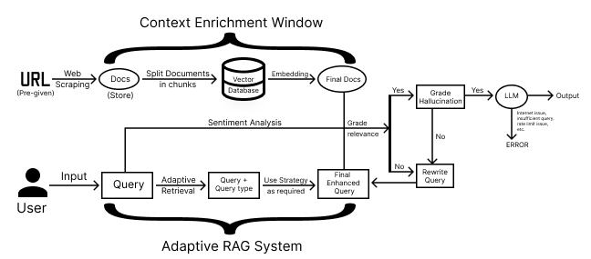

# Assessli Agentic AI Chatbot 🤖

## 🚀 Project Overview

This project presents the **Assessli Agentic AI Chatbot**, an advanced conversational assistant that combines **Retrieval-Augmented Generation (RAG)** with adaptive and modular enhancements. The system leverages AI to provide factually accurate, personalized, and context-rich responses in real time.

Two key innovations elevate its performance:
- **Adaptive Query Refinement**
- **Context-Enriched Document Indexing**

Together, these ensure precise document retrieval, deeper understanding, and dynamic generation cycles for higher reliability and relevance.

---

## 📊 Overall System Architecture



---

## 🧠 Internal Workflow

### 🔹 1. **User Query Input**
The interaction starts when the user submits a query through the chatbot interface.

### 🔹 2. **Chat Memory**
Stores session-based context using `ConversationBufferMemory` to enable continuity in dialogue.

### 🔹 3. **Adaptive Query Refinement**
- Classifies queries into: `factual`, `analytical`, `contextual`, or `opinion-based`.
- Chooses best-fit retrieval methods based on classification.
- Inspired by [Adaptive Retrieval by Nir Diamant](https://github.com/NirDiamant/RAG_Techniques/blob/main/all_rag_techniques/adaptive_retrieval.ipynb).

### 🔹 4. **Context-Enriched Document Indexing**
- Splits documents into semantically aware chunks and embeds surrounding content.
- Indexed using enriched vectors for deeper retrieval accuracy.
- Inspired by [Context Enrichment Window](https://github.com/NirDiamant/RAG_Techniques/blob/main/all_rag_techniques/context_enrichment_window_around_chunk.ipynb).

### 🔹 5. **Enhanced Retrieval Pipeline**
- Uses the refined query to retrieve semantically closest documents from FAISS.
- Forwards both query and results to the LLM for reasoning.

### 🔹 6. **Response Grading & Hallucination Filtering**
- Grades the output for:
  - ✅ Relevance to user query
  - ❌ Hallucination likelihood
- Flags uncertain answers for improvement or rewrite.

### 🔹 7. **Query Rewriting Loop**
- When output fails validation checks, the system initiates a **query rewrite loop** and re-runs the RAG process.

### 🔹 8. **Output Delivery or Exception Handling**
- Returns final validated response to the user.
- Handles edge cases such as empty input, broken documents, or LLM timeouts.

### 🔹 9. **Multimodal Content Processing**
- Supports PDF, DOCX, CSV, JSON, TXT, Images, Audio, and Video files.
- Detects file type and extracts structured content using a dedicated multimodal processor.
- Auto-generates queries or summaries based on file type + user input.
- Integrates extracted content into the RAG query loop.

### 🔹 10. **n8n Workflow Integration**
- Asynchronously sends key session data to an **n8n webhook** for logging, analysis, or automation.
- Includes:
  - User query and bot response
  - Sentiment analysis results
  - Session ID and timestamp
- Retries on failure with configurable timeout.

---

## 💡 Key Features

✅ Adaptive query classification  
✅ Context-aware semantic chunking  
✅ Query rewriting for reliability  
✅ File upload and multimodal input support  
✅ Real-time sentiment analysis  
✅ n8n integration for workflow automation  
✅ Modular, containerized architecture  
✅ Chat memory for context continuity

---

## 🧰 Tech Stack

| Module               | Tool/Framework                           |
|----------------------|------------------------------------------|
| **Orchestration**    | LangGraph                                |
| **Vector DB**        | FAISS (Meta)                             |
| **Containerization** | Docker                                   |
| **LLM Execution**    | LLaMA 3.1 via Groq                       |
| **Web Search**       | DuckDuckGo Search API                    |
| **Web Scraping**     | WebBaseLoader (LangChain)                |
| **Text Embedding**   | Hugging Face Sentence Transformers       |
| **Tokenizer**        | Hugging Face                             |
| **Text Cleaning**    | LangChain CharacterTextSplitter          |
| **Chat Memory**      | LangChain ConversationBufferMemory       |
| **Frontend**         | Flutter (Cross-platform)                 |
| **Backend**          | Flask (Python)                           |
| **TTS Engine**       | Deepgram                                 |
| **Multimodal Handling** | Custom processor (`rag_system`)      |
| **Webhook Automation** | n8n                                     |

---

## 📁 Supported File Types

| Type     | Formats                                          |
|----------|--------------------------------------------------|
| **Text** | PDF, DOCX, TXT, CSV, JSON, XML                   |
| **Image**| JPG, PNG, GIF, BMP, TIFF                         |
| **Audio**| MP3, WAV, AAC, FLAC, OGG, WMA                    |
| **Video**| MP4, AVI, MOV, WMV, FLV, WEBM                    |

---

## 🔐 API Keys Setup

You will need API keys to run the system:

- **Groq API Key**: Get from [https://console.groq.com/keys](https://console.groq.com/keys)  
- **Deepgram API Key**: Get from [https://console.deepgram.com/signup](https://console.deepgram.com/signup)  

Replace the respective `"YOUR_API_KEY"` placeholders in the `.env` or config files.

---

## 📱 Flutter Frontend Setup

> 🖥️ Run the following commands in your terminal:

```bash
# Clone the Repository
git clone https://github.com/Kunal-3004/Assessli-AI-Hackathon.git

# Navigate to the Flutter App Directory
cd Assessli-AI-Hackathon

# Install Flutter Dependencies
flutter pub get

# Launch the Flutter App
flutter run
```

---

## 🖥️ Backend Setup (Flask)

> 🧪 Backend must be set up in a terminal or shell with Docker installed:

```bash
# Navigate to the backend directory
cd Assessli-AI-Hackathon/backend

# Build Docker Image
docker build -t flask-agentic .

# Run Docker Container
docker run -p 5000:5000 flask-agentic
```

Make sure the Flask backend is up and running before testing the frontend chatbot.

---

## 🧪 Troubleshooting

- **API Key Not Working?** Double-check if the key is active and in the correct environment variable.
- **Port Already in Use?** Stop other services running on port 5000 or change port in the Docker run command.
- **Missing Dependencies?** Run `flutter pub get` again or check `pubspec.yaml`.

---

## 👥 Team Tridents, IIT (ISM) Dhanbad

---
